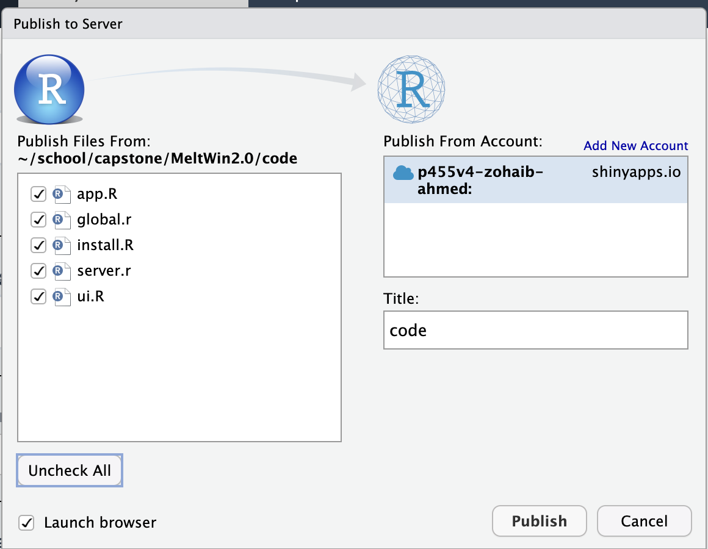
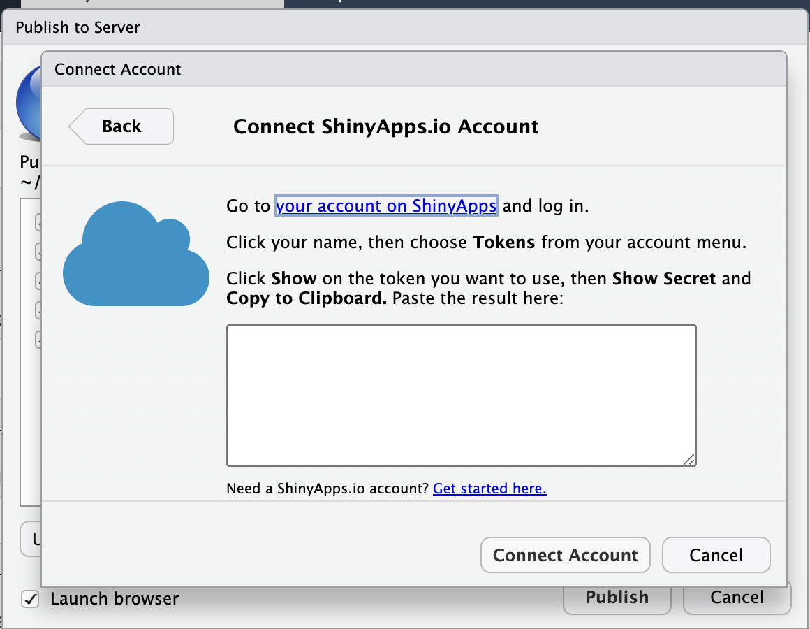

# Hosting a Shiny Application on shinyapps.io

This guide provides step-by-step instructions on how to publish a Shiny application to shinyapps.io. Ensure you have R and RStudio installed and an account set up on shinyapps.io before proceeding.

## Prerequisites

1. **Install R:** Ensure that R is installed on your system. If not, download and install it from [CRAN](https://cran.r-project.org/).

2. **Install RStudio:** Download and install RStudio from [here](https://posit.co/download/rstudio-desktop/).

3. **Shinyapps.io Account:** Create an account on [shinyapps.io](https://www.shinyapps.io/). Navigate to the 'Account' section, then 'Tokens', and copy the Token Secret. You will need this later.

## Publishing Your Shiny App

### Setting Up the Environment in RStudio

1. **Set Working Directory:**

   - Open RStudio.
   - Set the working directory to your project's code subdirectory. For example, if your project is named 'MeltWin2.0', you would use:
     ```R
     setwd("path/to/MeltWin2.0/code")
     ```
   - Confirm the directory change with `getwd()`.

2. **Install Shiny:**

   - Install MeltShiny into your R session in order to run the application.
     ```R
     install.packages("shiny")
     library("shiny")
     ```

3. **Run the Shiny Application:**
   - Use the `runApp()` command to start your Shiny application locally.
   - Ensure your application runs without any errors.

### Publishing to shinyapps.io

1. **Publish Application:**

   - In RStudio, click the 'Publish' button located in the top right corner of the application window after it is running.
   - 

2. **Add shinyapps.io Account:**

   - In the popup window that emerges, select 'Add New Account'.
   - 
   - Enter your shinyapps.io account details.
   - Apply the secret token you copied earlier.
   - 

3. **Complete the Publishing Process:**
   - Follow the prompts to publish your project to shinyapps.io.
   - Once the process is complete, your application will be build and deploy on shinyapps.io.
   - You will be able to view live metrics, error logs, usage in the shinyapps dashboard.

### Troubleshooting

- If you encounter issues during the publishing process, ensure your R and RStudio versions are up to date and that your shinyapps.io account is active.
- Check the R console for any error messages that may indicate issues with your Shiny application code or dependencies.
- Within the project dashboard in shinyapps, you can view the project logs to look for errors and determine the cause of issue.

## Additional Resources

- For more detailed instructions on using shinyapps.io, refer to their official documentation [here](https://docs.rstudio.com/shinyapps.io/).
- For general Shiny application development, the RStudio Shiny tutorials are an excellent resource, available [here](https://shiny.rstudio.com/tutorial/).
- These instructions are concurrent with the process of an article, available [here](https://statsandr.com/blog/how-to-publish-shiny-app-example-with-shinyapps-io/#introduction)

---
